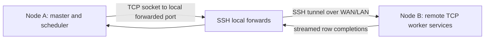

# Two-Node TCP Validation Experiment

This experiment is a small real-network validation for the sparse flexible coded
learning runtime.  It separates the master and workers across two machines while
keeping the same scheduler, streaming row completion, online first-decodability
test, and cancellation path used by the server-side TCP experiments.

## Goal

The experiment checks whether the main system claim survives a real cross-host
TCP path:

- Coded strategies should reduce first-decode latency and tail latency relative
  to speed-aware uncoded scheduling when worker speeds drift.
- The gain should remain visible after adding real serialization, socket I/O,
  remote worker services, and cancel messages.
- Network overhead should be measurable rather than hidden inside a synthetic
  timing model.

## Topology

The minimal topology uses two nodes:

- Node A: local master process running `run_tunneled_remote_network_experiment.py`.
- Node B: remote worker host running one TCP worker service per logical worker.

Most rented GPU/CPU servers expose only SSH, not arbitrary inbound worker ports.
Therefore the script starts remote workers bound to `127.0.0.1` on Node B and
creates one SSH local-forward per worker.  The master connects to local ports on
Node A; each connection is forwarded to the corresponding remote worker.  This
keeps the deployment usable on restricted cloud hosts while still exercising a
real two-node TCP path.



## Controlled Variables

Use the same problem instance and the same common jitter trace across strategies:

- `--common-jitter-across-strategies` removes an avoidable noise source in
  per-strategy comparisons.
- `--seed` controls the sparse ridge problem and worker speed trace.
- `--network-rtt-ms` and `--network-bandwidth-mbps` are optional extra
  emulation knobs.  For a pure real-network run, keep both at `0`.

Recommended strategy set:

- `speed_aware_uncoded`
- `sparse_flexible_static`
- `rank_aware_sparse_flexible`
- `system_portfolio`

This keeps the validation focused on the two paper claims: static sparse coded
placement is not enough under drift, while rank-aware and system-aware coded
scheduling preserve first-decode gains.

## Quick Smoke Command

Run from the repository root on Node A.  Put the remote password in an
environment variable rather than in the shell history.

```bash
export REMOTE_PASSWORD='...'
python run_tunneled_remote_network_experiment.py \
  --samples 800 --features 120 --density 0.02 \
  --shards 4 --workers 4 --rounds 2 \
  --scenario phase --drift-period 2 \
  --straggler-fraction 0.50 --straggler-slowdown 0.08 \
  --sleep-scale 0.01 --cost-scale 0.002 \
  --common-jitter-across-strategies \
  --remote-host <REMOTE_HOST> \
  --remote-ssh-port <REMOTE_SSH_PORT> \
  --remote-user root \
  --remote-repo /root/coded_distributed_computing_socc_runtime \
  --remote-out tunneled_remote_smoke \
  --local-base-port 27100 \
  --remote-base-port 28200 \
  --out tunneled_remote_smoke \
  --strategies speed_aware_uncoded sparse_flexible_static \
    rank_aware_sparse_flexible system_portfolio
```

## Paper-Scale Two-Node Sweep

After the smoke run passes, use the sweep driver.  It runs multiple seeds,
assigns non-overlapping local and remote worker ports, and then calls the
standard analyzer.

```bash
export REMOTE_PASSWORD='...'
python run_tunneled_remote_sweep.py \
  --samples 6000 --features 800 --density 0.008 \
  --shards 8 --workers 8 --rounds 8 \
  --scenario phase --drift-period 4 \
  --straggler-fraction 0.45 --straggler-slowdown 0.08 \
  --sleep-scale 0.03 --cost-scale 0.006 \
  --seeds 17 23 31 43 \
  --remote-host <REMOTE_HOST> \
  --remote-ssh-port <REMOTE_SSH_PORT> \
  --remote-user root \
  --remote-repo /root/coded_distributed_computing_socc_runtime \
  --local-base-port 27300 \
  --remote-base-port 28400 \
  --output-root tunneled_remote_sweep \
  --diagnostics-out tunneled_remote_diagnostics
```

The default strategy set includes speed-aware uncoded, speculative replication,
static sparse flexible coding, rank-aware sparse flexible coding, and the
system portfolio scheduler.  Add `--no-analyze` if you want to collect raw
seed outputs first and analyze later.

## Analysis

The sweep driver runs this command automatically.  To re-run analysis manually,
use the same baseline report used for the single-server TCP experiments:

```bash
python analyze_network_container_results.py \
  tunneled_remote_sweep/seed_17 \
  tunneled_remote_sweep/seed_23 \
  tunneled_remote_sweep/seed_31 \
  tunneled_remote_sweep/seed_43 \
  --baseline-strategy speed_aware_uncoded \
  --out tunneled_remote_diagnostics
```

The key files are:

- `network_metrics.csv`: per-round decode/barrier/cancel/network metrics.
- `network_summary.csv`: per-strategy averages for each run.
- `tunneled_remote_diagnostics/network_report.md`: aggregate comparison.
- `tunneled_remote_diagnostics/bootstrap_ci_vs_speed_aware_uncoded.csv`:
  seed-level bootstrap confidence intervals.

## Acceptance Criteria

Treat this as a validation experiment, not the main scaling result.  The result
is useful for the paper if:

- `rank_aware_sparse_flexible` and/or `system_portfolio` improve p95
  first-decode latency over `speed_aware_uncoded`.
- The sign of the improvement is stable across at least three seeds.
- The report includes network bytes, dispatch time, and cancel time, showing
  that gains are not produced by silently ignoring communication overhead.
- Static sparse flexible coding is weaker than the adaptive coded strategies,
  supporting the paper's claim that row placement and decodability must be
  matched to worker dynamics.

## Scope and Limitation

This setup validates cross-host execution under restricted cloud networking.
Because traffic goes through SSH forwarding, it is not a replacement for a
full cluster deployment with directly routable worker ports.  In the paper, use
it as an artifact-style sanity check alongside the larger TCP-isolated server
experiments.
